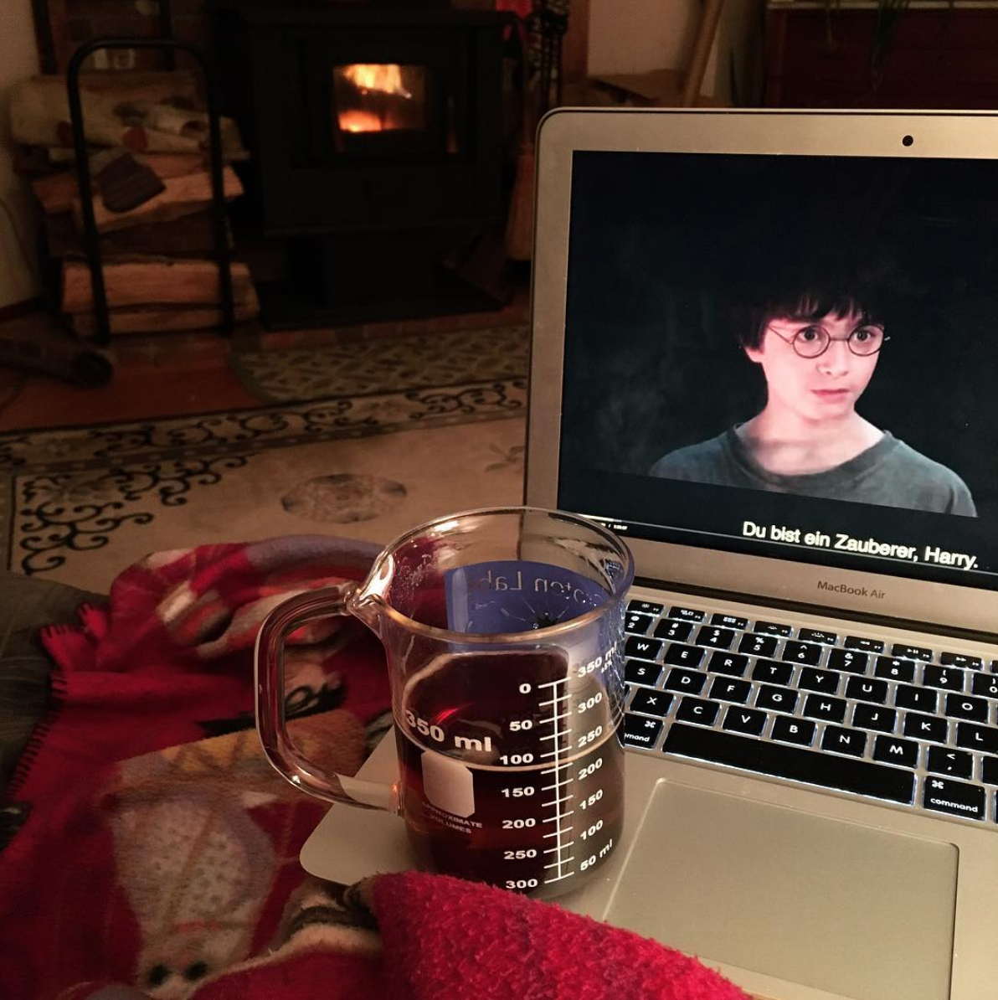
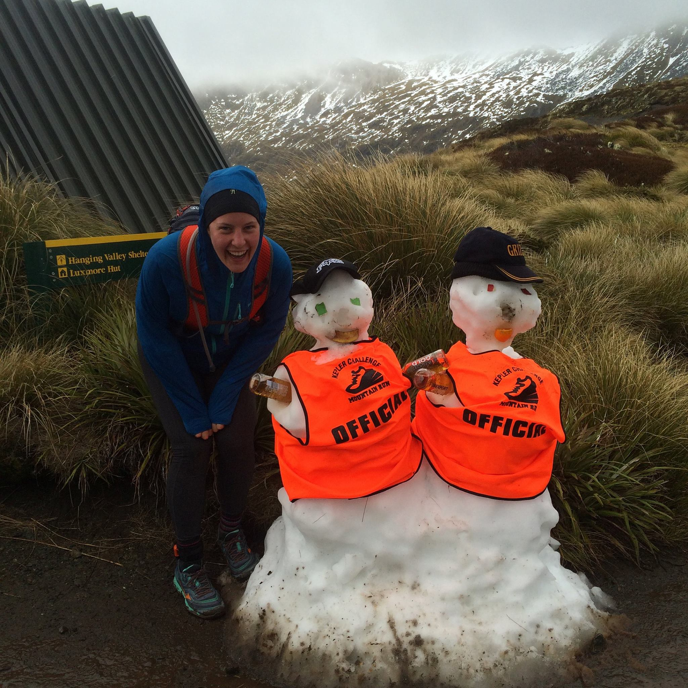

  [[Publications]](#publications) · <a href="/assets/pdf/Salesky_CV.pdf" target="_blank">[CV]</a>

### About Me

I am a PhD student at the [Center for Language and Speech Processing](https://www.clsp.jhu.edu/) at [Johns Hopkins University](https://www.cs.jhu.edu/), working with [Matt Post](https://matt.waypost.net/). 
Generally, I am interested in speech and text translation, language variation, and low-resource & multilingual speech and language processing.

Previously I was a Masters student at the [Language Technologies Institute](https://www.lti.cs.cmu.edu/) at [Carnegie Mellon University](https://www.cmu.edu/), where I was advised by Alex Waibel, and often worked with Alan Black and the lab at [KIT](http://isl.anthropomatik.kit.edu/english/), which I was lucky to visit in summers. 
My research focused on different aspects of speech and text translation, including phoneme-informed ST models, optimizing BPE segmentation online during MT training, and disfluency removal ([new dataset here!](https://github.com/isl-mt/fluent-fisher))

Before grad school, I worked at MIT Lincoln Laboratory in the Human Language Technology group from 2012-2017, focused primarily on machine translation and language learning applications.
I graduated from Dartmouth College in 2012, where I studied Math and Linguistics.
My undergraduate [thesis](http://linguistics.dartmouth.edu/undergraduate/honors/past-honors-theses) compared unsupervised segmentation methods on a set of unrelated languages with Ann Irvine.

When not at my computer, I like to [learn languages](https://www.duolingo.com/esalesky), run long distances, and bike to ice cream!

  

  

  

### Publications

<table>
  <thead>
    <tr>
      <th style="text-align: left">2021</th>
      <th style="text-align: left"></th>
    </tr>
  </thead>
  <tbody>
    <tr>
      <td>
        <a target="_blank" href="/assets/pdf/visrep_2021.pdf">Robust Open-Vocabulary Translation from Visual Text Representations</a>
        <paper>
          <authors><u>Elizabeth Salesky</u>, David Etter, Matt Post</authors>
        <venue>preprint</venue>
        </paper>
      </td>
      <td>
        <ul>
        </ul>
      </td>
    </tr>
    <tr>
      <td>
        <a target="_blank" href="/assets/pdf/mtedx_interspeech2021.pdf">The Multilingual TEDx Corpus for Speech Recognition and Translation</a>
        <paper>
          <authors><u>Elizabeth Salesky</u>, Matthew Wiesner, Jacob Bremerman, Roldano Cattoni, Matteo Negri, Marco Turchi, Douglas W. Oard, Matt Post</authors>
        <venue>Interspeech 2021</venue>
        </paper>
      </td>
      <td>
        <ul>
          <li><a target="_blank" href="http://openslr.org/100">data</a></li>
          <li><a target="_blank" href="https://github.com/pytorch/fairseq/blob/master/examples/speech_to_text/docs/mtedx_example.md">fairseq</a></li>
          <li><a target="_blank" href="https://github.com/m-wiesner/tedx">ASR code</a></li>
          <li><a target="_blank" href="https://github.com/esalesky/vecalign">ali code</a></li>
        </ul>
      </td>
    </tr>
    <tr>
      <td>
        <a target="_blank" href="/assets/pdf/iwslt_st2021.pdf">FINDINGS OF THE IWSLT 2021 EVALUATION CAMPAIGN</a>
        <paper>
          <authors>Antonios Anastasopoulos, Ondřej Bojar, Jacob Bremerman, Roldano Cattoni, Maha Elbayad, Marcello Federico, Xutai Ma, Satoshi Nakamura, Matteo Negri, Jan Niehues, Juan Pino, <u>Elizabeth Salesky</u>, Sebastian Stüker, Katsuhito Sudoh, Marco Turchi, Alexander Waibel, Changhan Wang, Matthew Wiesner</authors>
        <venue>IWSLT 2021</venue>
        </paper>
      </td>
      <td>
        <ul>
          <li><a target="_blank" href="https://iwslt.org/2021/">site</a></li>
          <li><a target="_blank" href="http://openslr.org/100">data</a></li>
        </ul>
      </td>
    </tr>
    <tr>
      <td>
        <a target="_blank" href="/assets/pdf/sigtyp_st2021.pdf">SIGTYP 2021 Shared Task: Robust Spoken Language Identification</a>
        <paper>
          <authors><u>Elizabeth Salesky</u>, Badr M. Abdullah, Sabrina Mielke, Elena Klyachko, Oleg Serikov, Edoardo Maria Ponti, Ritesh Kumar, Ryan Cotterell, Ekaterina Vylomova</authors>
        <venue>SIGTYP 2021</venue>
        </paper>
      </td>
      <td>
        <ul>
          <li><a target="_blank" href="https://sigtyp.github.io/st2021.html">site</a></li>
        </ul>
      </td>
    </tr>
  </tbody>
  <thead>
    <tr>
      <th style="text-align: left">2020</th>
      <th style="text-align: left"></th>
    </tr>
  </thead>
  <tbody>
    <tr>
      <td>
        <a target="_blank" href="/assets/pdf/sigtyp_st2020.pdf">SIGTYP 2020 Shared Task: Prediction of Typological Features</a>
        <paper>
          <authors>Johannes Bjerva, <u>Elizabeth Salesky</u>, Sabrina J. Mielke, Aditi Chaudhary, Giuseppe G. A. Celano, Edoardo M. Ponti, Ekaterina Vylomova, Ryan Cotterell, Isabelle Augenstein</authors>
        <venue>SIGTYP 2020</venue>
        </paper>
      </td>
      <td>
        <ul>
          <li><a target="_blank" href="https://sigtyp.github.io/st2020.html">site</a></li>
          <li><a target="_blank" href="https://github.com/sigtyp/ST2020">data</a></li>
        </ul>
      </td>
    </tr>
    <tr>
      <td>
        <a target="_blank" href="/assets/pdf/interspeech20_relativepos.pdf">Relative Positional Encoding for Speech Recognition and Direct Translation</a>
        <paper>
          <authors>Ngoc-Quan Pham, Thanh-Le Ha, Tuan-Nam Nguyen, Thai-Son Nguyen, <u>Elizabeth Salesky</u>, Sebastian Stueker, Jan Niehues, Alex Waibel</authors>
        <venue>INTERSPEECH 2020</venue>
        </paper>
      </td>
      <td>
        <ul>
          <li><a target="_blank" href="https://github.com/quanpn90/NMTGMinor">code</a></li>
          <li><a target="_blank" href="http://www.interspeech2020.org/index.php?m=content&c=index&a=show&catid=243&id=313">video</a></li>
        </ul>
      </td>
    </tr>
    <tr>
      <td>
        <a target="_blank" href="/assets/pdf/acl20_voxclamantis.pdf">A Corpus For Large-Scale Phonetic Typology</a>
        <paper>
          <authors><u>Elizabeth Salesky</u>, Eleanor Chodroff, Tiago Pimental, Matthew Wiesner, Ryan Cotterell, Alan W Black, Jason Eisner</authors>
        <venue>ACL 2020</venue>
        </paper>
      </td>
      <td>
        <ul>
          <li><a target="_blank" href="https://voxclamantisproject.github.io/">site</a></li>
          <li><a target="_blank" href="https://drive.google.com/drive/folders/10jsQgT5anb-E97DZMbGJjwPZ-Ux91xMM">data</a></li>
          <li><a target="_blank" href="https://github.com/VoxClamantisProject?tab=repositories">code</a></li>
          <li><a target="_blank" href="https://virtual.acl2020.org/paper_main.415.html">video</a></li>
          <li><a target="_blank" href="/assets/pdf/acl20_vox_slides.pdf">slides</a></li>
        </ul>
      </td>
    </tr>
    <tr>
      <td>
        <a target="_blank" href="/assets/pdf/acl20_GER.pdf">Generalized Entropy Regularization or: There's Nothing Special about Label Smoothing</a>
        <paper>
          <authors>Clara Meister, <u>Elizabeth Salesky</u>, Ryan Cotterell</authors>
        <venue>ACL 2020</venue>
        </paper>
      </td>
      <td>
        <ul>
          <li></li>
          <li><a target="_blank" href="https://virtual.acl2020.org/paper_main.615.html">video</a></li>          
          <li><a target="_blank" href="/assets/pdf/acl20_ger_slides.pdf">slides</a></li>
        </ul>
      </td>
    </tr>
    <tr>
      <td>
        <a target="_blank" href="/assets/pdf/acl20_phones4st.pdf">Phone Features Improve Speech Translation</a>
        <paper>
          <authors><u>Elizabeth Salesky</u>, Alan W Black</authors>
        <venue>ACL 2020</venue>
        </paper>
      </td>
      <td>
        <ul>
          <li><a target="_blank" href="https://virtual.acl2020.org/paper_main.217.html">video</a></li>
          <li><a target="_blank" href="/assets/pdf/acl20_phones4st_slides.pdf">slides</a></li>
          <li><a target="_blank" href="https://github.com/esalesky/xnmt-devel">code</a></li>
        </ul>
      </td>
    </tr>
    <tr>
      <td>
        <a target="_blank" href="/assets/pdf/2020.iwslt-overview.pdf">Findings of the 2020 IWSLT Evaluation Campaign</a>
        <paper>
          <authors>Ebrahim Ansari, Nguyen Bach, Ondřej Bojar, Roldano Cattoni, Fahim Dalvi, Nadir Durrani, Marcello Federico, Christian Federmann, Jiatao Gu, Fei Huang, Kevin Knight, Xutai Ma, Ajay Nagesh, Matteo Negri, Jan Niehues, Juan Pino, <u>Elizabeth Salesky</u>, Xing Shi, Sebastian Stüker, Marco Turchi, Alex Waibel, Changhan Wang</authors>
        <venue>IWSLT 2020</venue>
        </paper>
      </td>
      <td>
        <ul>
          <li><a target="_blank" href="http://iwslt.org/doku.php?id=conversational_speech_translation">task</a></li>
          <li><a target="_blank" href="https://github.com/isl-mt/fluent-fisher">fluent  &nbsp;data</a></li>
          <li><a target="_blank" href="https://github.com/esalesky/fisher-mapping">code</a></li>
        </ul>
      </td>
    </tr>
    <tr>
      <td>
        <a target="_blank" href="/assets/pdf/2020.sigmorphon-task0.pdf">SIGMORPHON 2020 Shared Task 0: Typologically Diverse Morphological Inflection</a>
        <paper>
          <authors>Ekaterina Vylomova, Jennifer White, <u>Elizabeth Salesky</u>, Sabrina J Mielke, Shijie Wu, Edoardo Ponti, Rowan Hall Maudslay, Ran Zmigrod, Josef Valvoda, Svetlana Toldova, Francis Tyers, Elena Klyachko, Ilya Yegorov, Natalia Krizhanovsky, Paula Czarnowska, Irene Nikkarinen, Andrew Krizhanovsky, Tiago Pimentel, Lucas Torroba Hennigen, Christo Kirov, Garrett Nicolai, Adina Williams, Antonios Anastasopoulos, Hilaria Cruz, Eleanor Chodroff, Ryan Cotterell, Miikka Silfverberg, Mans Hulden</authors>
        <venue>SIGMORPHON 2020</venue>
        </paper>
      </td>
      <td>
        <ul>
          <li><a target="_blank" href="https://sigmorphon.github.io/sharedtasks/2020/task0">task</a></li>
          <li><a target="_blank" href="https://github.com/sigmorphon2020/data">data</a></li>
          <li><a target="_blank" href="https://github.com/sigmorphon2020/baselines">code</a></li>
          <li><a target="_blank" href="https://slideslive.com/38929870/sigmorphon-2020-shared-task-0-typologically-diverse-morphological-inflection">video</a></li>
        </ul>
      </td>
    </tr>
    <tr>
      <td>
        <a target="_blank" href="/assets/pdf/mtj_optimizing.pdf">Optimizing Segmentation Granularity for Neural Machine Translation</a>
        <paper>
          <authors><u>Elizabeth Salesky</u>, Andrew Runge, Alex Coda, Jan Niehues, Graham Neubig</authors>
        <venue>Machine Translation 2020. arXiv:1810.08641 Oct. 2018</venue>
        </paper>
      </td>
      <td>
        <ul>
          <li><a target="_blank" href="https://github.com/esalesky/NYFNN">code</a></li>
        </ul>
      </td>
    </tr>
  </tbody>
  <thead>
    <tr>
      <th style="text-align: left">2019</th>
      <th style="text-align: left"></th>
    </tr>
  </thead>
  <tbody>
    <tr>
      <td>
        <a target="_blank" href="/assets/pdf/iwslt19_overview.pdf">The IWSLT 2019 Evaluation Campaign</a>
        <paper>
          <authors>Jan Niehues, Roldano Cattoni, Sebastian Stüker, Matteo Negri, Marco Turchi, Thanh-Le Ha, <u>Elizabeth Salesky</u>, Ramon Sanabria, Loïc Barrault, Lucia Specia, Marcello Federico</authors>
        <venue>IWSLT 2019</venue>
        </paper>
      </td>
      <td>
        <ul>
          <li><a target="_blank" href="https://workshop2019.iwslt.org/">site</a></li>
        </ul>
      </td>
    </tr>
    <tr>
      <td>
        <a target="_blank" href="/assets/pdf/acl19_exploring.pdf">Exploring Phoneme-Level Speech Representations for End-to-End Speech Translation</a>
        <paper>
          <authors><u>Elizabeth Salesky</u>, Matthias Sperber, Alan W Black</authors>
        <venue>ACL 2019</venue>
        </paper>
      </td>
      <td>
        <ul>
          <li><a target="_blank" href="https://vimeo.com/384515395">video</a></li>
        </ul>
      </td>
    </tr>
    <tr>
      <td>
        <a target="_blank" href="/assets/pdf/sigmorphon19_cmu-01.pdf">CMU-01 at the SIGMORPHON 2019 Shared Task on Crosslinguality and Context in Morphology</a>
        <paper>
          <authors>Aditi Chaudhary, <u>Elizabeth Salesky</u>, Gayatri Bhat, David R. Mortensen, Jaime G. Carbonell, Yulia Tsvetkov</authors>
        <venue>SIGMORPHON 2019 <i>(Interpretability Prize)</i></venue>
        </paper>
      </td>
      <td>
        <ul>
          <li><a target="_blank" href="https://github.com/Aditi138/MorphologicalAnalysis">code</a></li>
          <li><a target="_blank" href="/assets/pdf/sigmorphon19_poster.pdf">poster</a></li>
        </ul>
      </td>
    </tr>
    <tr>
      <td>
        <a target="_blank" href="/assets/pdf/naacl19_fluent.pdf">Fluent Translations from Disfluent Speech in End-to-End Speech Translation</a>
        <paper>
          <authors><u>Elizabeth Salesky</u>, Matthias Sperber, Alex Waibel</authors>
        <venue>NAACL 2019</venue>
        </paper>
      </td>
      <td>
        <ul>
          <li><a target="_blank" href="/assets/pdf/naacl19_poster.pdf">poster</a></li>
        </ul>
      </td>
    </tr>
  </tbody>
  <thead>
    <tr>
      <th style="text-align: left">2018</th>
      <th style="text-align: left"></th>
    </tr>
  </thead>
  <tbody>
    <tr>
      <td>
        <a target="_blank" href="/assets/pdf/slt18_towards.pdf">Towards Fluent Translations from Disfluent Speech</a>
        <paper>
          <authors><u>Elizabeth Salesky</u>, Susanne Burger, Alex Waibel</authors>
        <venue>SLT 2018</venue>
        </paper>
      </td>
      <td>
        <ul>
          <li><a target="_blank" href="https://github.com/isl-mt/fluent-fisher">data</a></li>
          <li><a target="_blank" href="https://github.com/esalesky/fisher-mapping">code</a></li>
          <li><a target="_blank" href="/assets/pdf/slt18_poster.pdf">poster</a></li>
        </ul>
      </td>
    </tr>
    <tr>
      <td>
        <a target="_blank" href="/assets/pdf/coling18_lt.pdf">KIT Lecture Translator: Multilingual Speech Translation with One-Shot Learning</a>
        <paper>
          <authors>Florian Dessloch, Thanh-Le Ha, Markus Müller, Jan Niehues, Thai-Son Nguyen, Ngoc-Quan Pham, <u>Elizabeth Salesky</u>, Matthias Sperber, Sebastian Stüker, Thomas Zenkel, Alex Waibel</authors>
        <venue>COLING 2018</venue>
        </paper>
      </td>
      <td>
      </td>
    </tr>
  </tbody>
  <thead>
    <tr>
      <th style="text-align: left">2017</th>
      <th style="text-align: left"></th>
    </tr>
  </thead>
  <tbody>
    <tr>
      <td>
        <a target="_blank" href="/assets/pdf/iwslt17_kit.pdf">KIT’s Multilingual Neural Machine Translation systems for IWSLT 2017</a>
        <paper>
          <authors>Ngoc-Quan Pham, Matthias Sperber, <u>Elizabeth Salesky</u>, Thanh-Le Ha, Jan Niehues, Alex Waibel</authors>
        <venue>IWSLT 2017</venue>
        </paper>
      </td>
      <td>
        <ul>
        </ul>
      </td>
    </tr>
    <tr>
      <td>
        <a target="_blank" href="/assets/pdf/wmt17_afrl-ll.pdf">The AFRL-MITLL WMT17 Systems: Old, New, Borrowed, BLEU</a>
        <paper>
          <authors>Jeremy Gwinnup, Timothy Anderson, Michaeel Kazi, <u>Elizabeth Salesky</u>, Grant Erdmann, Katherine Young, Brian Thompson, Jonathan Taylor</authors>
        <venue>WMT 2017</venue>
        </paper>
      </td>
      <td>
        <ul>
        </ul>
      </td>
    </tr>
  </tbody>
  <thead>
    <tr>
      <th style="text-align: left">2016</th>
      <th style="text-align: left"></th>
    </tr>
  </thead>
  <tbody>
    <tr>
      <td>
        <a target="_blank" href="/assets/pdf/iwslt16_afrl-ll.pdf">The MITLL-AFRL IWSLT 2016 Systems</a>
        <paper>
          <authors>Michaeel Kazi, <u>Elizabeth Salesky</u>, Brian Thompson, Jonathon Taylor, Jeremy Gwinnup, Timothy Anderson, Grant Erdmann, Eric Hansen, Brian Ore, Katherine Young, Michael Hutt</authors>
        <venue>IWSLT 2016</venue>
        </paper>
      </td>
      <td>
        <ul>
        </ul>
      </td>
    </tr>
    <tr>
      <td>
        <a target="_blank" href="/assets/pdf/wmt16_afrl-ll.pdf">The AFRL-MITLL WMT16 News-Translation Task Systems</a>
        <paper>
          <authors>Jeremy Gwinnup, Timothy Anderson, Michaeel Kazi, <u>Elizabeth Salesky</u>, Grant Erdmann, Katherine Young, Brian Thompson</authors>
        <venue>WMT 2016</venue>
        </paper>
      </td>
      <td>
        <ul>
        </ul>
      </td>
    </tr>
    <tr>
      <td>
        <a target="_blank" href="/assets/pdf/lrec16_kws.pdf">Operational Assessment of Keyword Search on Oral History</a>
        <paper>
          <authors><u>Elizabeth Salesky</u>, Jessica Ray, Wade Shen</authors>
        <venue>LREC 2016</venue>
        </paper>
      </td>
      <td>
        <ul>
        </ul>
      </td>
    </tr>
  </tbody>
  <thead>
    <tr>
      <th style="text-align: left">2015</th>
      <th style="text-align: left"></th>
    </tr>
  </thead>
  <tbody>
    <tr>
      <td>
        <a target="_blank" href="/assets/pdf/iwslt15_afrl-ll.pdf">The MITLL-AFRL IWSLT 2015 MT System</a>
        <paper>
          <authors>Michaeel Kazi, Brian Thompson, <u>Elizabeth Salesky</u>, Timothy Anderson, Grant Erdmann, Eric Hansen, Brian Ore, Jeremy Gwinnup, Katherine Young, Michael Hutt, Christina May</authors>
        <venue>IWSLT 2015</venue>
        </paper>
      </td>
      <td>
        <ul>
        </ul>
      </td>
    </tr>
    <tr>
      <td>
        <a target="_blank" href="/assets/pdf/wmt15_afrl-ll.pdf">The AFRL-MITLL WMT15 System: There’s More than One Way to Decode It!</a>
        <paper>
          <authors>Jeremy Gwinnup, Timothy Anderson, Michaeel Kazi, <u>Elizabeth Salesky</u>, Grant Erdmann, Katherine Young, Brian Thompson, Christina May</authors>
        <venue>WMT 2015</venue>
        </paper>
      </td>
      <td>
        <ul>
        </ul>
      </td>
    </tr>
  </tbody>
  <thead>
    <tr>
      <th style="text-align: left">2014</th>
      <th style="text-align: left"></th>
    </tr>
  </thead>
  <tbody>
    <tr>
      <td>
        <a target="_blank" href="/assets/pdf/iwslt14_afrl-ll.pdf">The MITLL-AFRL IWSLT 2014 MT System</a>
        <paper>
          <authors>Michaeel Kazi, <u>Elizabeth Salesky</u>, Brian Thompson, Jessica Ray, Michael Coury, Wade Shen, Tim Anderson, Grant Erdmann, Jeremy Gwinnup, Katherine Young, Brian Ore, Michael Hutt</authors>
        <venue>IWSLT 2014</venue>
        </paper>
      </td>
      <td>
        <ul>
        </ul>
      </td>
    </tr>
    <tr>
      <td>
        <a target="_blank" href="/assets/pdf/bea14_ilr.pdf">Exploiting Morphological, Grammatical, and Semantic Correlates for Improved Text Difficulty Assessment</a>
        <paper>
          <authors><u>Elizabeth Salesky</u>, Wade Shen</authors>
        <venue>BEA 2014</venue>
        </paper>
      </td>
      <td>
        <ul>
        </ul>
      </td>
    </tr>
  </tbody>
  <thead>
    <tr>
      <th style="text-align: left">2013</th>
      <th style="text-align: left"></th>
    </tr>
  </thead>
  <tbody>
    <tr>
      <td>
        <a target="_blank" href="/assets/pdf/iwslt13_afrl-ll.pdf">The MIT-LL/AFRL IWSLT-2013 MT system</a>
        <paper>
          <authors>Michaeel Kazi, Michael Coury, <u>Elizabeth Salesky</u>, Jessica Ray, Wade Shen, Terry Gleason, Tim Anderson, Grant Erdmann, Lane Schwartz, Brian Ore, Raymond Slyh, Jeremy Gwinnup, Katherine Young, Michael Hutt</authors>
        <venue>IWSLT 2013</venue>
        </paper>
      </td>
      <td>
        <ul>
        </ul>
      </td>
    </tr>
    <tr>
      <td>
        <a target="_blank" href="/assets/pdf/pitr13_ilr.pdf">A Language-Independent Approach to Automatic Text Difficulty Assessment for Second-Language Learners</a>
        <paper>
          <authors>Wade Shen, Jennifer Williams, Tamas Marius, <u>Elizabeth Salesky</u></authors>
        <venue>PITR 2013</venue>
        </paper>
      </td>
      <td>
        <ul>
        </ul>
      </td>
    </tr>
  </tbody>
</table>